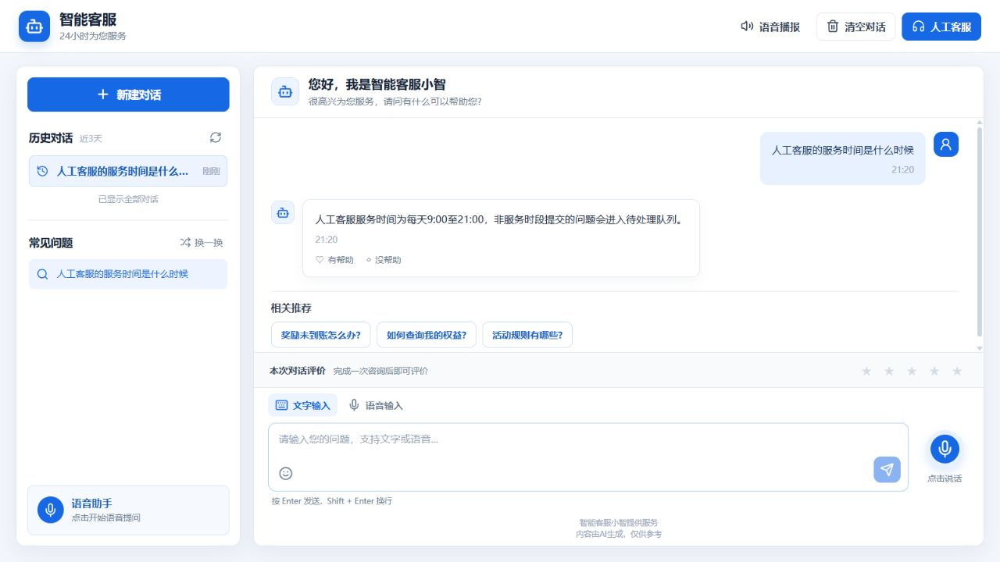
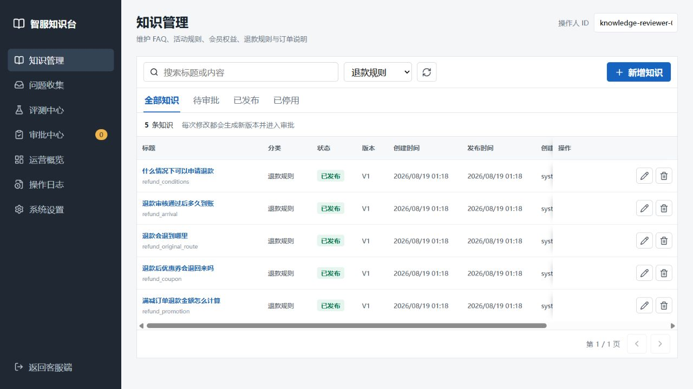
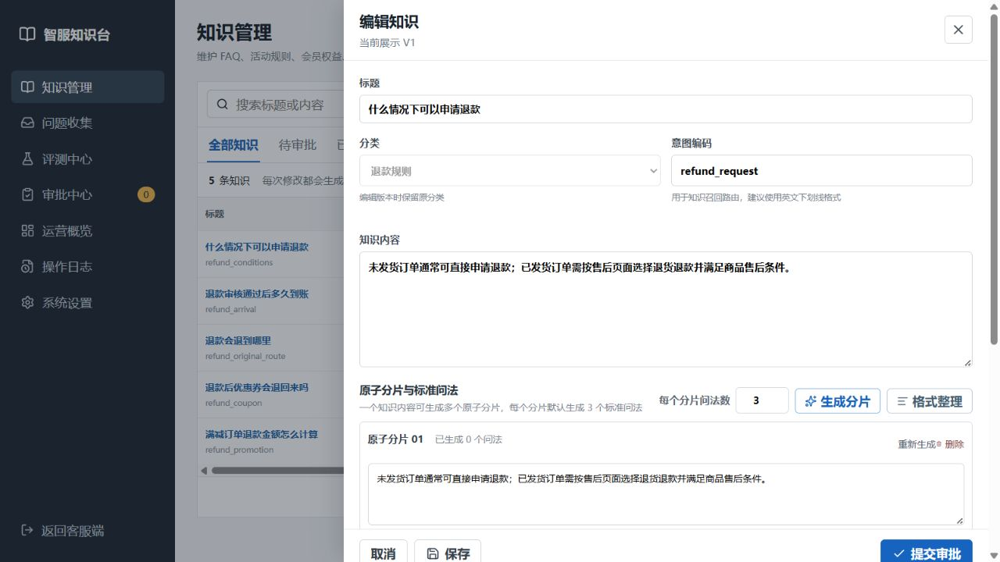
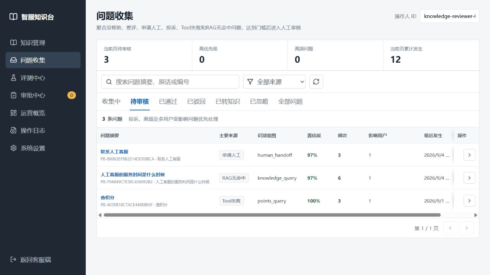
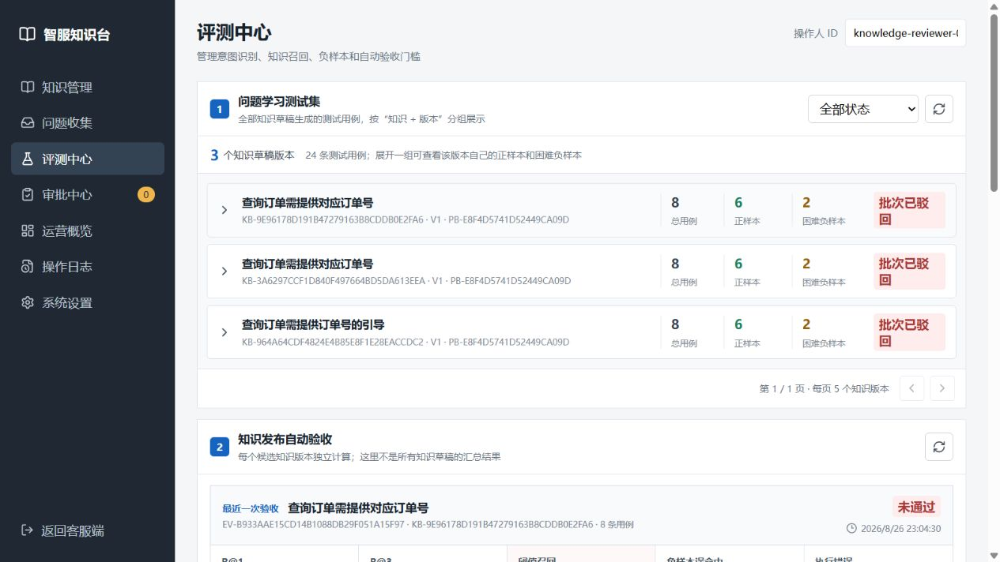
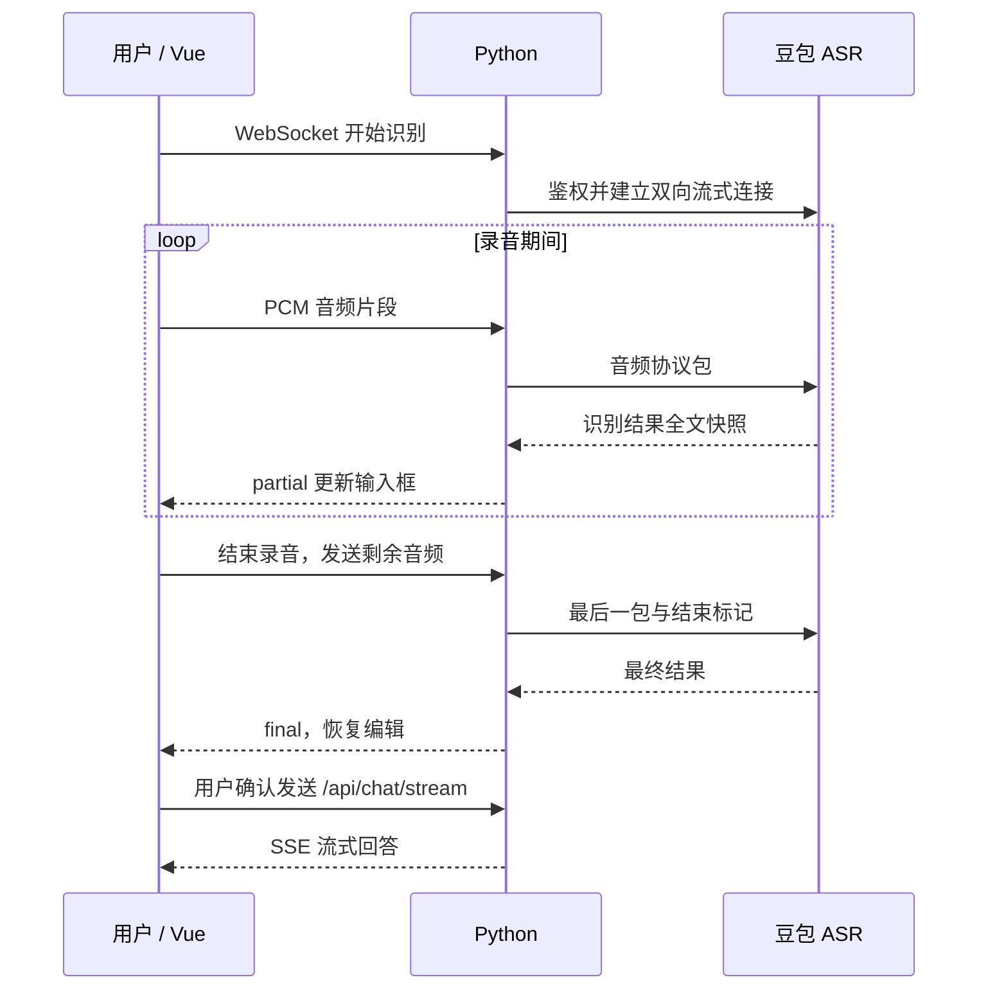
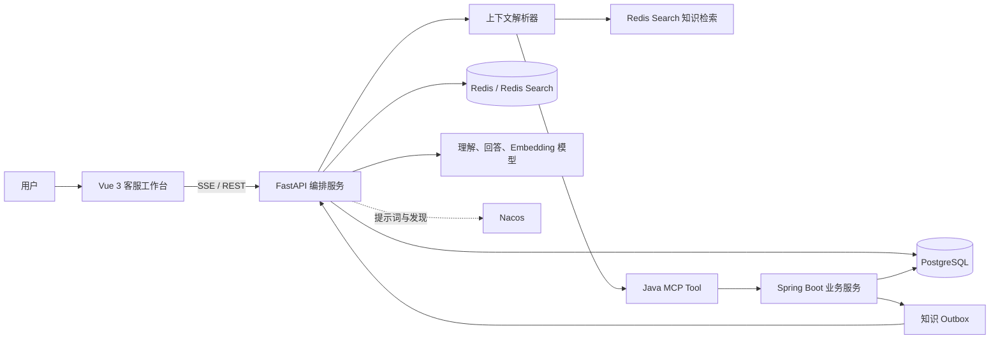
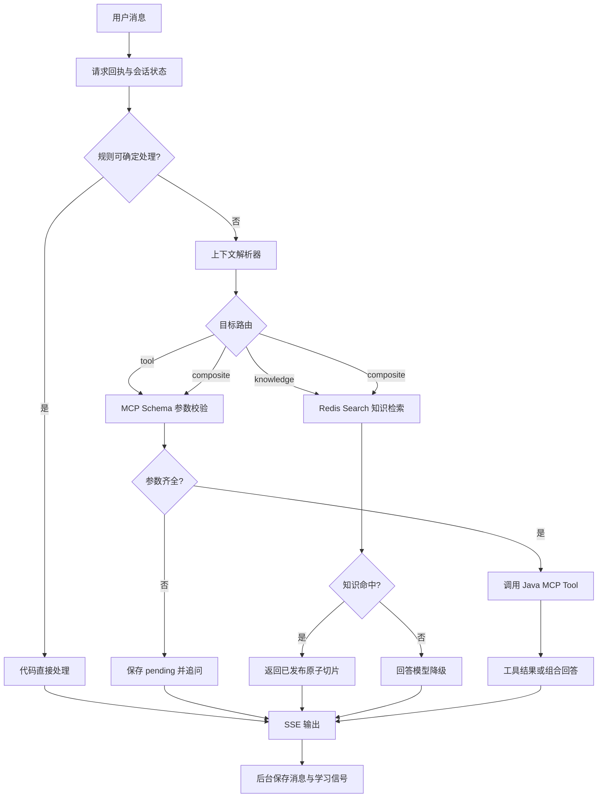
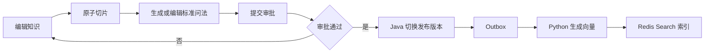

# Smart Customer Service

一个面向客服场景的全栈智能服务系统。Vue 3 提供客服工作台和知识后台；Python 负责上下文解析、会话编排、知识检索与 SSE 输出；Java 负责 MCP 业务工具、知识审批发布和工具审计。

系统边界明确：模型理解用户表达，代码维护状态和权限，Java 执行确定性业务规则。PostgreSQL 是业务与知识主数据源，Redis 保存可重建的会话状态和检索索引。

## 导航

- [页面展示](#页面展示)
- [核心能力](#核心能力)
- [操作手册](#操作手册)
- [本地启动](#本地启动)
- [配置要点](#配置要点)
- [常见问题与排障](#常见问题与排障)
- [架构](#架构) · [聊天链路](#聊天链路) · [主要接口](#主要接口) · [测试](#测试)

## 页面展示
本项目仅用于个人学习，如商用请获取许可！

### 客服工作台

支持文字咨询、实时语音转文字、常见问题快捷查询、历史会话和回答反馈。语音识别完成后，用户可编辑文字再发送。



### 知识管理

按分类、关键字和发布状态查询知识，查看版本及审批信息，新增或修改内容后进入审批流程。



<details>
<summary>展开查看知识编辑：原子分片与标准问法</summary>

编辑标题、分类、意图编码、正文、生效时间及申请说明；生成分片后逐条核对问法与答案的对应关系。



</details>

### 问题收集

汇总没帮助、差评、申请人工、投诉、工具失败和知识未命中等信号，按状态审核，再转为知识草稿与测试集。



### 评测中心

按知识版本管理测试用例，查看自动发布验收及失败原因，也可以运行固定数据集的离线基准评测并下载报告。



## 核心能力

- SSE 流式客服对话、历史会话、反馈与会话评价。
- 豆包双向流式 ASR：麦克风采集、实时文字修正、结束补齐、编辑确认后发送。
- 四字段上下文解析器，支持续填、纠正、取消、插话、恢复和任务引用。
- 订单、积分、奖励、权益、退款等 Java MCP Tool。
- 知识草稿、原子切片、标准问法、审批、Outbox 发布和 Redis Search 检索。
- 问题学习、知识发布验收、离线评测和工具调用审计。
- Nacos 提示词版本、局部路由规则与 MCP 服务发现。
- 聊天链路分段计时，定位模型、Redis、数据库、MCP 和持久化耗时。

| 模块 | 可以完成什么 | 使用入口 |
| --- | --- | --- |
| 客服对话 | 业务查询、知识问答、多轮补参、任务切换与 SSE 回答 | 客服首页 |
| 语音输入 | 边说边识别，结束后修改或发送，取消恢复原输入 | “语音输入”“点击说话”“语音助手” |
| 知识运营 | 内容分片、标准问法、版本审批、发布与停用 | 知识管理、审批中心 |
| 问题学习 | 问题聚合、人工核对标准答案、生成知识草稿和回归用例 | 问题收集 |
| 质量验证 | 单版本发布验收、固定数据集评测、失败用例与报告 | 评测中心 |

### 当前实现边界

- 当前使用演示用户标识和可填写的“操作人 ID”，尚未接入完整登录与角色权限体系；操作人字段用于记录操作，不能视为身份认证。
- 退款包含试算、确认申请和异步处理流程，支付网关目前为模拟实现，不会完成真实渠道退款。
- 顶部“语音播报”“人工客服”按钮目前为预留入口；实时语音输入已经接通，但不包含回答的语音合成或真人坐席连接。
- 后台“运营概览”“操作日志”“系统设置”菜单目前为预留入口。已有日志与审计能力不等于这些页面已经完成。

## 操作手册

### 1. 页面入口

先按[本地启动](#本地启动)完成服务启动，再打开对应地址。

| 页面 | 本地地址 |
| --- | --- |
| 客服工作台 | <http://localhost:5173/> |
| 知识管理 | <http://localhost:5173/#/knowledge> |
| 问题收集 | <http://localhost:5173/#/knowledge/problems> |
| 评测中心 | <http://localhost:5173/#/knowledge/evaluation> |

后台侧栏可切换模块，“返回客服端”回到聊天页。客服侧栏展示近 3 天会话；小屏设备可通过“历史对话”按钮展开侧栏。

### 2. 文字咨询与多轮对话

1. 点击“新建对话”，在输入框输入问题，例如“我想查一下订单”。
2. 点击发送按钮或按 `Enter`；`Shift + Enter` 用于换行。回答会逐段显示。
3. 如果客服追问订单号，直接补充当前演示用户有权查询的实际订单号。示例字符串不是数据库中的通用测试订单。
4. 参数说错时可继续纠正；不再办理时输入“取消”。查询积分、权益等业务时，身份由服务端当前用户上下文提供。
5. 点击左侧已有会话可查看历史并继续咨询；需要切换到独立话题时点击“新建对话”。“清空对话”重置当前聊天界面，不用于删除数据库中的历史记录。

可试用的表达：

| 意图 | 示例 | 预期行为 |
| --- | --- | --- |
| 订单查询 | 我想查一下订单 | 缺少订单号时追问，补齐后查询 |
| 积分查询 | 我的积分什么时候过期 | 查询当前用户的积分信息 |
| 权益查询 | 我现在有哪些会员权益 | 查询当前用户权益 |
| 知识问答 | 已领取的优惠券在哪里查看 | 优先检索已发布知识 |
| 退款咨询 | 我想申请退款 | 先收集参数、校验并试算，明确确认后才提交申请 |

点击左侧“常见问题”可读取对应的已发布知识，“换一换”切换问题列表。聊天示例的具体答案由当前业务数据与知识版本决定。

### 3. 实时语音输入

1. 使用 `localhost`、`127.0.0.1` 或 HTTPS 打开客服页面，并连接麦克风。
2. 点击“语音输入”、右侧“点击说话”或左侧“语音助手”，首次使用时允许浏览器访问麦克风。
3. 等状态变为“正在聆听”后开始说话。识别文字持续显示在输入框中，后续结果可能修正前面的文字和标点。
4. 点击“结束录音”，等待“识别完成，可修改文字后点击发送”。单次录音默认最多 60 秒，到时自动结束。
5. 核对订单号、人名等内容，必要时编辑，再点击发送。录音和等待最终结果期间不能发送，结束录音也不会自动发送消息。
6. 不需要这次录音时点击“取消”，输入框恢复到录音前的内容。断线时已识别文字会保留，并提示核对。

音频通过 WebSocket 以 **16kHz、单声道、16 位 PCM 小端序**传输，每 100ms 一包。Python 只在内存中转发，不生成录音文件，也不将识别正文写入 ASR 日志；用户确认发送的文字进入已有聊天存储流程。此说明仅描述本项目，不代表供应商侧的数据保留策略。



### 4. 回答反馈与会话评价

回答下方出现“有帮助”“没帮助”后，可以提交本条回答的反馈。会话满足评价条件、星级按钮启用后，可点击 1～5 星提交评价。按钮禁用或显示“已评价”时，不能重复提交该项反馈。

反馈进入后端学习流程；问题是否出现在待审核列表，还取决于聚合、去重、触发门槛与后台处理进度，并非每次点击都会立即生成一条待审核问题。

### 5. 新增、修改与发布知识

1. 打开“知识管理”，填写“操作人 ID”，点击“新增知识”。
2. 填写标题，选择分类，设置意图编码（例如 `refund_request`）、知识内容及生效时间；按需补充标签、失效时间和申请说明。
3. 点击“生成分片”，将正文拆成能独立回答问题的原子分片。每个分片默认生成 3 个标准问法，可设置为 1～8 个。
4. 逐条检查分片与问法，避免问法扩大答案的适用范围。可修改分片、重新生成问法、添加问法或手工新增分片；“格式整理”用于整理正文排版。
5. 点击“提交审批”。修改既有知识时，点击标题或编辑图标进入编辑抽屉；已有记录可使用“保存”保留草稿，审批中的版本会限制重复提交。
6. 在“待审批”或“审批中心”查看申请，核对正文、版本和申请说明后通过；不符合要求时填写驳回原因再确认驳回。
7. 审批后的发布由后台流程继续处理，包括 Outbox 与向量索引同步。确认状态为“已发布”后，回客服端使用标准问法及同义表达验证召回；不要仅凭“审批通过”判断整个发布链路完成。
8. 下线知识时使用“申请停用”，再处理相应审批。编辑既有版本时分类保留原值。

建议用明确的业务规则编写知识，例如“积分在发放后的第 12 个月月底失效”，并写清适用范围；不要把互不相关的规则放在同一个分片中。

### 6. 将问题转为知识

1. 打开“问题收集”，通过关键字、问题来源和状态筛选记录。
2. “收集中”的问题可点击“提交审核”，再点击“确认提交”；“待审核”的问题点击摘要或“查看并处理”打开详情。
3. 核对代表问法、真实问题样本、频次与影响用户；按页面操作生成或编辑标准回答，确认内容正确后再审核通过。驳回时必须填写原因，无需处理的记录可忽略。
4. 在“已通过”问题中点击“生成知识草稿与测试集”，选择 8、10、12 或 15 条测试用例。
5. 核对知识标题、分类、标签、发布时间、标准问法和测试集。测试问法应覆盖口语、省略、错别字、倒装／追问、边界和困难负样本。
6. 点击“提交知识审批”，再到知识管理处理审批。问题转为“已转知识”表示已进入知识审批，不能视为已经发布。

知识草稿正文来自已审核标准回答；若正文有误，应先重新进行问题审核，避免只修改测试用例来掩盖答案问题。

### 7. 查看验收与运行评测

1. 打开“评测中心”，在“问题学习测试集”按状态筛选，展开某个“知识 + 版本”分组查看用例及预期结果。
2. 在“知识发布自动验收”查看单个候选版本的状态与失败原因；使用“查看明细”切换运行记录，重点检查距离超阈值、目标知识未排第一和负样本误命中。
3. 当前页面显示的发布门槛包括：`R@1 ≥ 80%`、`R@3 = 100%`、阈值内正样本召回率 `≥ 80%`、困难负样本误命中率 `= 0%`、执行错误数 `= 0`。知识距离阈值默认 `0.38`，以该次运行记录为准。
4. 单个用例通过不代表整个候选版本通过。修正知识或问法后，应按流程提交新版本重新验收。
5. 在“离线基准评测”选择固定数据集，点击“开始评测”，等待运行完成后查看指标，通过 `JSON` 或 `Markdown` 下载报告。

离线评测可能调用模型、Embedding 和 Redis，消耗时间及供应商额度；它用于固定数据集回归，与单个知识版本的发布验收分别记录。截图中的未通过记录用于展示定位问题的方式。

## 架构



| 层 | 职责 |
| --- | --- |
| Vue | 客服工作台、知识后台、SSE 消费与交互 |
| Python | 上下文解析、会话状态、路由、知识检索、模型调用与评测 |
| Java | MCP Tool、业务校验、事务、知识审批、发布 Outbox 与审计 |
| PostgreSQL | 会话、消息、业务数据、知识版本、审批、学习与评测主数据 |
| Redis | 会话状态、请求回执、锁、知识/问法/Tool 向量索引 |

## 聊天链路



### 上下文解析器

模型只输出当前轮次的四个字段：

```json
{
  "act": "inform",
  "target": "order_query",
  "values": {"orderId": "ORDER_20260809001"},
  "query": null
}
```

| 字段 | 说明 |
| --- | --- |
| `act` | `start`、`inform`、`correct`、`cancel`、`interrupt`、`resume`、`followup`、`unknown` |
| `target` | MCP 工具、系统路由、`knowledge` 或服务端给出的 `frame:ID` |
| `values` | 仅本轮消息明确给出的参数；禁止传入身份和请求字段 |
| `query` | 知识子问题；没有时为 `null` |

代码维护当前 Tool、参数、待补字段、确认状态、任务栈、最近任务和参数来源。明确订单号续填、取消、候选序号和绑定确认优先由代码处理，无需模型调用。

### 知识检索规则

知识正文和标准问法都会写入 `idx:cs:knowledge`。标准问法与原子切片共享同一答案和命中阈值。

- 上下文解析器先确定 `target=knowledge`，随后才查询 Redis。
- 知识检索使用余弦距离，`distance <= 0.38` 才命中，约等于相似度 `>= 0.62`。
- 已发布知识命中后直接返回原子切片，保证速度和事实可追溯性。
- 知识未命中后才检索 LangCache；仍未命中时交给回答模型。
- 线上知识应按可独立回答的原子问题切片，不能把整篇活动规则作为单个答案。

## MCP Tool

| Tool | 作用 | 主要参数 |
| --- | --- | --- |
| `order_query` | 查询订单状态和物流 | `orderId` |
| `points_query` | 查询积分余额与到期信息 | 当前登录用户 |
| `reward_query` | 查询活动奖励状态 | `activityName` 可选 |
| `benefits_query` | 查询会员等级与已有权益 | 当前登录用户 |
| `refund_query` | 查询退款进度 | `orderId` |
| `refund_quote` | 退款资格和金额试算 | 订单与退款参数 |
| `refund_apply` | 创建退款申请 | 试算后明确确认 |

`sessionId`、`userId` 和 `requestId` 由 Python 注入，模型和前端不能伪造。写操作必须经过明确确认；Java 使用受限后台线程保存不含聊天原文的 Tool 审计。

## 知识管理与发布



标准问法由模型在知识编辑/发布流程中生成，不在用户聊天主链路调用。人工可以修改生成结果。已发布知识变化时，Outbox 驱动索引更新；Redis 丢失后可从 PostgreSQL 当前发布版本重建。

## 本地启动

### 前置条件

- Node.js 20+ 与 npm。
- Python 3.12 与 [uv](https://docs.astral.sh/uv/)。
- JDK 21 与 Maven 3.8+。
- PostgreSQL、Redis Stack 或带 Redis Search 模块的 Redis。
- 可选：Nacos 3.x、OpenAI 兼容的理解/回答/Embedding 模型。

首次获取项目，在 PowerShell 中执行：

```powershell
git clone https://github.com/chinz-marx/smart-customer-service.git
cd smart-customer-service
```

复制示例配置并填写本地值。已有 `.env` 时保留原配置，不要覆盖：

```powershell
if (-not (Test-Path backend/.env)) {
    Copy-Item backend/.env.example backend/.env
}
```

`backend/.env`、密码、Token 和运行日志均不会提交到 Git。

完整业务联调需要在 Python 配置中启用 PostgreSQL、Redis、知识检索和 MCP，并填写对应连接地址与模型配置。演示业务数据可参考 [demo-data.sql](./business-service/scripts/demo-data.sql)，仅在测试数据库按需导入；真实订单查询依赖当前演示用户对应的数据。

启动顺序：**基础服务 → Java 健康检查通过 → Python 初始化完成 → 前端**。下面三个服务各占用一个独立终端，命令均从仓库根目录开始；按 `Ctrl+C` 停止对应服务。

### 启动 Java

Java 默认不会读取 Python 的 `.env`。先设置环境变量，再使用 JDK 21 重新编译打包并运行；数据库应与 Python 指向同一套测试环境，内部 Token 必须与 Python 的 `BUSINESS_TOOL_INTERNAL_TOKEN` 一致。

```powershell
cd business-service
$env:JAVA_HOME = 'E:\workSoft\jdk21\jdk-21.0.6' # 改为本机 JDK 21 路径
$env:PATH = "$env:JAVA_HOME\bin;$env:PATH"
$env:BUSINESS_DATABASE_URL = 'jdbc:postgresql://127.0.0.1:5432/smart_customer_service'
$env:BUSINESS_DATABASE_USERNAME = 'postgres'
$env:BUSINESS_DATABASE_PASSWORD = '<数据库密码>'
$env:BUSINESS_REDIS_URL = 'redis://:<Redis密码>@127.0.0.1:6379/0'
$env:TOOL_INTERNAL_TOKEN = '<与Python配置一致的内部Token>'

# 需要 Maven 在 PATH 中；也可以使用本机 mvn.cmd 的绝对路径
mvn clean package -DskipTests
if ($LASTEXITCODE -ne 0) { throw 'Java 打包失败，请先处理构建错误' }
& "$env:JAVA_HOME\bin\java.exe" -jar .\target\business-service-0.1.0-SNAPSHOT.jar
```

启动时 Flyway 会校验并执行数据库迁移。默认端口 `8081`，健康检查为 `GET /actuator/health`，预期 `status=UP`。上述打包命令跳过测试；修改业务逻辑后请执行[测试](#测试)中的 Java 检查。修改 Java 源码后需重新打包，直接运行旧 JAR 不会加载源码改动。

### 启动 Python

```powershell
cd backend
uv sync --python 3.12
# 让本机 Java/MCP 请求绕过系统代理；如已有 NO_PROXY，请合并原值
$env:NO_PROXY = 'localhost,127.0.0.1,::1'
uv run --python 3.12 python -m app.main
```

默认端口 `8000`，健康检查为 `GET /api/health`。`APP_RELOAD=true` 仅适用于本地开发；修改核心服务后建议进行干净重启，避免遗留子进程。

### 启动前端

```powershell
cd frontend
npm install
npm run dev
```

默认地址 `http://localhost:5173`。Vite 将 `/api` 代理给 Python，将 `/business-api` 代理给 Java。

### 验证启动结果

```powershell
Invoke-RestMethod http://127.0.0.1:8081/actuator/health
Invoke-RestMethod http://127.0.0.1:8000/api/health
```

Java 应返回 `UP`；完整联调模式下，Python 的 `status`、`session_store_status`、`persistence_status`、`semantic_search_status` 和 `mcp_status` 应正常，且 `mcp_tools` 包含业务工具。仅看到 Uvicorn 的端口提示还不代表初始化结束，需要等待 `Application startup complete`。

## 配置要点

| 配置 | 用途 |
| --- | --- |
| `UNDERSTANDING_*` | 上下文解析模型；推荐快速结构化输出模型 |
| `DOUBAO_*` | 回答、知识标准问法与 Embedding 模型配置 |
| `ASR_API_KEY` | 豆包语音新控制台 API Key，只配置在后端 |
| `ASR_WS_URL` | 默认 `wss://openspeech.bytedance.com/api/v3/sauc/bigmodel_async` |
| `ASR_RESOURCE_ID` | 默认 `volc.seedasr.sauc.duration` |
| `ASR_MAX_DURATION_SECONDS` | 单次录音上限，默认 60 秒 |
| `ASR_MAX_CONNECTIONS` | 每个 Python 进程的 ASR 并发连接上限，默认 16 |
| `SESSION_STORE_BACKEND` | `memory` 或 `redis` |
| `PERSISTENCE_BACKEND` | `memory` 或 `postgres` |
| `SEMANTIC_SEARCH_ENABLED` | Redis Search 知识和 LangCache |
| `MCP_ENABLED` | 启用 Java MCP Tool |
| `NACOS_ENABLED` | 提示词、局部路由规则和 MCP 服务发现 |
| `KNOWLEDGE_DISTANCE_THRESHOLD` | 知识命中距离阈值，默认 `0.38` |

语音使用 `X-Api-Key` 鉴权，每次录音生成新的 UUID。ASR 密钥与聊天模型密钥分别配置，不能通过 `VITE_` 变量发送到浏览器。部署语音功能需要 HTTPS 和反向代理的 WebSocket Upgrade 支持；跨域网页来源需在 `CORS_ORIGINS` 中明确配置。

Nacos 不可用时，Python 使用本地提示词、本地局部路由和 `MCP_SERVER_URL` 回退地址。生产环境应通过部署平台注入密钥，不要将真实值写入示例配置或 `application.yml`。

## 主要接口

| 服务 | 接口 | 用途 |
| --- | --- | --- |
| Python | `POST /api/chat/stream` | SSE 聊天，事件为 `delta`、`done`、`error` |
| Python | `WS /api/speech/stream` | 实时语音识别，事件为 `ready`、`partial`、`final`、`error` |
| Python | `POST /api/chat` | 非流式聊天 |
| Python | `GET /api/conversations` | 历史会话 |
| Python | `POST /api/feedback` | 单条反馈和评分 |
| Python | `POST /api/knowledge/chunks/split` | 知识原子切片 |
| Python | `POST /api/knowledge/questions/generate` | 生成标准问法 |
| Python | `POST /api/internal/knowledge/publish` | Java Outbox 发布索引 |
| Java | `GET /api/admin/knowledge` | 知识和审批后台 |
| Java | `GET /api/admin/faq/questions` | 已发布 FAQ |
| Java | `/mcp` | MCP Streamable HTTP 服务 |

## 常见问题与排障

| 现象 | 检查与处理 |
| --- | --- |
| Java 提示 class 版本不兼容 | 检查 `java -version` 与 `mvn -version`，确保编译和运行均使用 JDK 21 |
| 修改了 Java 但页面行为没变化 | 停止旧进程，重新 `mvn clean package`，运行新生成的 JAR |
| Java 数据库连接失败 | 检查环境变量、数据库可达性、用户名密码；Java 不自动读取 `backend/.env` |
| Python MCP 初始化失败，Java 健康正常 | 检查内部 Token、MCP 地址和系统代理；为本机地址设置 `NO_PROXY`，先启动 Java，再重启 Python |
| 页面可打开，但接口 500／连接被拒绝 | 检查 8000 与 8081 服务；确认 Vite 的 `/api`、`/business-api` 代理目标 |
| 启动提示端口已占用 | 先确认占用进程，关闭自己之前启动的旧实例；避免重复运行同一服务 |
| 麦克风不可用或权限被拒绝 | 使用 HTTPS 或 localhost，在浏览器站点设置中允许麦克风，并检查输入设备 |
| 提示语音服务未配置／鉴权失败 | 检查后端 `ASR_API_KEY` 与资源开通状态；默认资源为 `volc.seedasr.sauc.duration` |
| 录音结束后仍在等待 | 等待最终结果；超时或断线时核对已保留文字，再重试录音 |
| 知识审批后仍未召回 | 检查发布状态、生效时间、Outbox、Python 日志及 Redis Search 索引；确认所问内容属于该分片 |
| 问题没有立即出现在待审核 | 检查学习功能、后台处理进度、聚合门槛以及“收集中”“全部问题”筛选 |
| 评测排名第一但仍未通过 | 排名命中与距离达标是不同条件，检查距离阈值、正样本召回及困难负样本误命中 |

## 可观测性与性能

Python 为 `/api/chat` 和 `/api/chat/stream` 记录 `chat_timing` JSON 日志，覆盖：

- 会话锁、Redis 回执和上下文读写；
- PostgreSQL 会话/消息读写；
- 上下文解析、候选 Tool、模型调用；
- 知识检索、MCP 调用、回答模型；
- 首个回答字节、SSE 完成与总耗时。

嵌套 span 可能重叠，不能直接相加。消息持久化与用户可见回答分离，消息与学习信号在后台任务中按顺序保存。

## 测试

```powershell
# Python
cd backend
uv run pytest -q -p no:cacheprovider

# 前端类型检查与构建
cd ../frontend
npm run test:speech
npm run build

# Java
cd ..
mvn -f business-service/pom.xml test
```

真实模型和 Redis 集成测试默认不运行，必须显式设置对应环境变量。发布前应额外执行知识召回评测与 Java Flyway/MCP 联调。

## 项目结构

```text
smart-customer-service/
├─ frontend/                 Vue 客服端与知识后台
├─ backend/
│  ├─ app/dialogue/          上下文解析与任务状态机
│  ├─ app/retrieval/         切片、标准问法、向量发布与检索
│  ├─ app/tools/             MCP 客户端、Schema 校验、Tool 召回
│  ├─ app/speech/            双向流式 ASR 协议与 WebSocket 转发
│  ├─ app/learning/          问题学习与知识包生成
│  ├─ app/observability/     聊天链路计时
│  └─ tests/
├─ business-service/
│  └─ src/main/
│     ├─ java/               MCP、知识、审批、审计和业务服务
│     └─ resources/db/       Flyway 迁移
└─ docs/images/              README 截图
```

## 相关文档

- [Python 服务说明](./backend/README.md)
- [Java 服务说明](./business-service/README.md)
