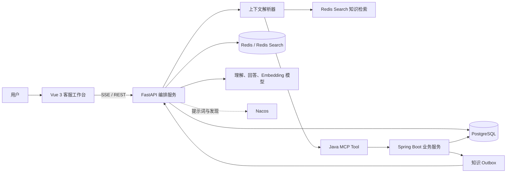
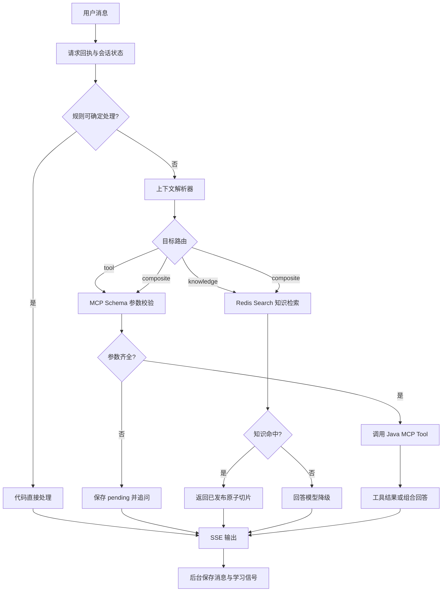
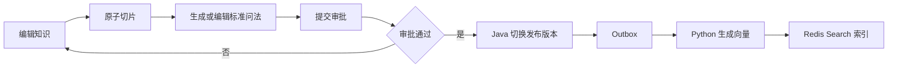

# Smart Customer Service

一个面向客服场景的全栈智能服务系统。Vue 3 提供客服工作台和知识后台；Python 负责上下文解析、会话编排、知识检索与 SSE 输出；Java 负责 MCP 业务工具、知识审批发布和工具审计。

系统边界明确：模型理解用户表达，代码维护状态和权限，Java 执行确定性业务规则。PostgreSQL 是业务与知识主数据源，Redis 保存可重建的会话状态和检索索引。

## 核心能力

- SSE 流式客服对话、历史会话、反馈与会话评价。
- 四字段上下文解析器，支持续填、纠正、取消、插话、恢复和任务引用。
- 订单、积分、奖励、权益、退款等 Java MCP Tool。
- 知识草稿、原子切片、标准问法、审批、Outbox 发布和 Redis Search 检索。
- 问题学习、知识发布验收、离线评测和工具调用审计。
- Nacos 提示词版本、局部路由规则与 MCP 服务发现。
- 聊天链路分段计时，定位模型、Redis、数据库、MCP 和持久化耗时。

## 架构



| 层 | 职责 |
| --- | --- |
| Vue | 客服工作台、知识后台、SSE 消费与交互 |
| Python | 上下文解析、会话状态、路由、知识检索、模型调用与评测 |
| Java | MCP Tool、业务校验、事务、知识审批、发布 Outbox 与审计 |
| PostgreSQL | 会话、消息、业务数据、知识版本、审批、学习与评测主数据 |
| Redis | 会话状态、请求回执、锁、知识/问法/Tool 向量索引 |

## 聊天链路



### 上下文解析器

模型只输出当前轮次的四个字段：

```json
{
  "act": "inform",
  "target": "order_query",
  "values": {"orderId": "ORDER_20260809001"},
  "query": null
}
```

| 字段 | 说明 |
| --- | --- |
| `act` | `start`、`inform`、`correct`、`cancel`、`interrupt`、`resume`、`followup`、`unknown` |
| `target` | MCP 工具、系统路由、`knowledge` 或服务端给出的 `frame:ID` |
| `values` | 仅本轮消息明确给出的参数；禁止传入身份和请求字段 |
| `query` | 知识子问题；没有时为 `null` |

代码维护当前 Tool、参数、待补字段、确认状态、任务栈、最近任务和参数来源。明确订单号续填、取消、候选序号和绑定确认优先由代码处理，无需模型调用。

### 知识检索规则

知识正文和标准问法都会写入 `idx:cs:knowledge`。标准问法与原子切片共享同一答案和命中阈值。

- 上下文解析器先确定 `target=knowledge`，随后才查询 Redis。
- 知识检索使用余弦距离，`distance <= 0.38` 才命中，约等于相似度 `>= 0.62`。
- 已发布知识命中后直接返回原子切片，保证速度和事实可追溯性。
- 知识未命中后才检索 LangCache；仍未命中时交给回答模型。
- 线上知识应按可独立回答的原子问题切片，不能把整篇活动规则作为单个答案。

## MCP Tool

| Tool | 作用 | 主要参数 |
| --- | --- | --- |
| `order_query` | 查询订单状态和物流 | `orderId` |
| `points_query` | 查询积分余额与到期信息 | 当前登录用户 |
| `reward_query` | 查询活动奖励状态 | `activityName` 可选 |
| `benefits_query` | 查询会员等级与已有权益 | 当前登录用户 |
| `refund_query` | 查询退款进度 | `orderId` |
| `refund_quote` | 退款资格和金额试算 | 订单与退款参数 |
| `refund_apply` | 创建退款申请 | 试算后明确确认 |

`sessionId`、`userId` 和 `requestId` 由 Python 注入，模型和前端不能伪造。写操作必须经过明确确认；Java 使用受限后台线程保存不含聊天原文的 Tool 审计。

## 知识管理与发布



标准问法由模型在知识编辑/发布流程中生成，不在用户聊天主链路调用。人工可以修改生成结果。已发布知识变化时，Outbox 驱动索引更新；Redis 丢失后可从 PostgreSQL 当前发布版本重建。

## 本地启动

### 前置条件

- Node.js 20+ 与 npm。
- Python 3.12 与 [uv](https://docs.astral.sh/uv/)。
- JDK 21 与 Maven 3.8+。
- PostgreSQL、Redis Stack 或带 Redis Search 模块的 Redis。
- 可选：Nacos 3.x、OpenAI 兼容的理解/回答/Embedding 模型。

复制示例配置并填写本地值：

```powershell
Copy-Item backend/.env.example backend/.env
```

`backend/.env`、密码、Token 和运行日志均不会提交到 Git。

### 启动 Java

Java 会执行 Flyway 迁移，再暴露 MCP 和知识管理接口：

```powershell
$env:JAVA_HOME = '你的 JDK 21 路径'
mvn -f business-service/pom.xml spring-boot:run
```

默认端口 `8081`，健康检查为 `GET /actuator/health`。

### 启动 Python

```powershell
cd backend
uv sync --python 3.12
uv run python -m app.main
```

默认端口 `8000`，健康检查为 `GET /api/health`。`APP_RELOAD=true` 仅适用于本地开发；修改核心服务后建议进行干净重启，避免遗留子进程。

### 启动前端

```powershell
cd frontend
npm install
npm run dev
```

默认地址 `http://localhost:5173`。Vite 将 `/api` 代理给 Python，将 `/business-api` 代理给 Java。

## 配置要点

| 配置 | 用途 |
| --- | --- |
| `UNDERSTANDING_*` | 上下文解析模型；推荐快速结构化输出模型 |
| `DOUBAO_*` | 回答、知识标准问法与 Embedding 模型配置 |
| `SESSION_STORE_BACKEND` | `memory` 或 `redis` |
| `PERSISTENCE_BACKEND` | `memory` 或 `postgres` |
| `SEMANTIC_SEARCH_ENABLED` | Redis Search 知识和 LangCache |
| `MCP_ENABLED` | 启用 Java MCP Tool |
| `NACOS_ENABLED` | 提示词、局部路由规则和 MCP 服务发现 |
| `KNOWLEDGE_DISTANCE_THRESHOLD` | 知识命中距离阈值，默认 `0.38` |

Nacos 不可用时，Python 使用本地提示词、本地局部路由和 `MCP_SERVER_URL` 回退地址。生产环境应通过部署平台注入密钥，不要将真实值写入示例配置或 `application.yml`。

## 主要接口

| 服务 | 接口 | 用途 |
| --- | --- | --- |
| Python | `POST /api/chat/stream` | SSE 聊天，事件为 `delta`、`done`、`error` |
| Python | `POST /api/chat` | 非流式聊天 |
| Python | `GET /api/conversations` | 历史会话 |
| Python | `POST /api/feedback` | 单条反馈和评分 |
| Python | `POST /api/knowledge/chunks/split` | 知识原子切片 |
| Python | `POST /api/knowledge/questions/generate` | 生成标准问法 |
| Python | `POST /api/internal/knowledge/publish` | Java Outbox 发布索引 |
| Java | `GET /api/admin/knowledge` | 知识和审批后台 |
| Java | `GET /api/admin/faq/questions` | 已发布 FAQ |
| Java | `/mcp` | MCP Streamable HTTP 服务 |

## 可观测性与性能

Python 为 `/api/chat` 和 `/api/chat/stream` 记录 `chat_timing` JSON 日志，覆盖：

- 会话锁、Redis 回执和上下文读写；
- PostgreSQL 会话/消息读写；
- 上下文解析、候选 Tool、模型调用；
- 知识检索、MCP 调用、回答模型；
- 首个回答字节、SSE 完成与总耗时。

嵌套 span 可能重叠，不能直接相加。消息持久化与用户可见回答分离，消息与学习信号在后台任务中按顺序保存。

## 测试

```powershell
# Python
cd backend
uv run pytest -q -p no:cacheprovider

# 前端类型检查与构建
cd ../frontend
npm run build

# Java
cd ..
mvn -f business-service/pom.xml test
```

真实模型和 Redis 集成测试默认不运行，必须显式设置对应环境变量。发布前应额外执行知识召回评测与 Java Flyway/MCP 联调。

## 项目结构

```text
smart-customer-service/
├─ frontend/                 Vue 客服端与知识后台
├─ backend/
│  ├─ app/dialogue/          上下文解析与任务状态机
│  ├─ app/retrieval/         切片、标准问法、向量发布与检索
│  ├─ app/tools/             MCP 客户端、Schema 校验、Tool 召回
│  ├─ app/learning/          问题学习与知识包生成
│  ├─ app/observability/     聊天链路计时
│  └─ tests/
├─ business-service/
│  └─ src/main/
│     ├─ java/               MCP、知识、审批、审计和业务服务
│     └─ resources/db/       Flyway 迁移
└─ docs/images/              README 截图
```

## 相关文档

- [Python 服务说明](./backend/README.md)
- [Java 服务说明](./business-service/README.md)
