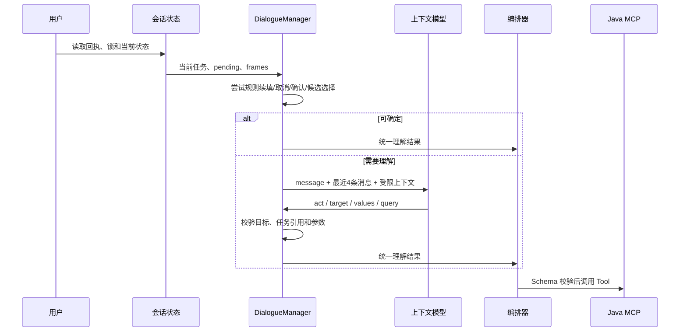

# 对话上下文中间件

在线聊天使用 `app/dialogue/manager.py` 的 `DialogueManager`。它位于消息接入和业务编排之间：接收当前消息与代码维护的会话状态，输出已校验的理解结果；它不直接执行 MCP Tool。

## 设计原则

1. 模型只理解本轮，代码维护历史和状态。
2. 明确续填、取消、确认、候选选择优先走代码规则。
3. 模型不拥有用户身份、请求 ID、工具状态或执行权限。
4. 每轮最多选择一个工具，可附带一个知识子问题。
5. 不确定的指代、无效任务引用和模型失败都先澄清，不猜测执行。

## 四字段协议

Nacos 提示词键为 `smart-customer-context-system`，本地兜底模板与其保持同一协议。

```json
{
  "act": "correct",
  "target": "frame:previous-order",
  "values": {"orderId": "ORDER_20260809002"},
  "query": null
}
```

| 字段 | 可选值或规则 |
| --- | --- |
| `act` | `start`、`inform`、`correct`、`cancel`、`interrupt`、`resume`、`followup`、`unknown` |
| `target` | 当前可用 Tool、系统路由、`knowledge` 或代码提供的 `frame:ID` |
| `values` | 仅当前消息中明确出现的工具参数；更正只能保留新值 |
| `query` | 知识子问题；纯工具请求为 `null` |

模型不得传入 `userId`、`sessionId`、`requestId`，不得复制历史参数，不能创建任务 ID，也不能返回状态快照。协议中的内部 `confidence=1.0` 只是结构和目录校验通过后的兼容标记，不代表模型概率。

## 状态归属

`ConversationState` 与 `DialogueContext` 由代码保存：

| 字段 | 用途 |
| --- | --- |
| `active_tool` / `tool_arguments` | 当前业务和已校验参数 |
| `tool_status` | `awaiting_args`、`executing`、`uncertain` 等执行状态 |
| `frame_id` | 当前任务稳定引用 |
| `pending` | 待补槽位、候选选择或明确确认 |
| `knowledge_query` | 当前工具任务附带的知识子问题 |
| `suspended` | 最多 5 个被插话挂起的任务 |
| `recent` | 最多 5 个最近完成任务，用于安全引用 |
| `argument_sources` | 参数来自消息、候选、确认或任务引用的证据 |

任务快照随会话 TTL 过期。旧 Redis JSON 缺少 `dialogue` 时会被恢复为空上下文。

## 处理顺序



### 规则优先路径

- 当前 Tool 正在等待 `orderId`，用户只发送合法订单号：直接填充，不调用模型。
- `取消`、`不查了`：仅取消当前待办任务。
- 有 `pending.confirmation` 时，明确确认才写入 `confirmed=true`；“好的”不构成授权。
- 有候选选择时，“第 2 个”只能引用已展示候选。
- `继续` 恢复当前或最近挂起任务；没有待办时要求重新说明。

### 插话、恢复与纠正

- `interrupt`：将当前任务快照放入 `suspended`，启动临时任务。
- 临时任务完成后：恢复栈顶挂起任务及其 `pending`。
- `resume`：只能恢复有效挂起任务；已完成任务不会被“继续”隐式重新执行。
- `correct`：在状态副本中校验新参数，校验失败不会污染当前任务。
- `frame:`：只能引用代码提供的唯一任务；多个候选时返回 `unknown`。

## 工具与知识路由

- 查个人实时状态或办理业务：选择 Tool。
- 问规则、条件、计算、流程且不依赖个人记录：选择 `knowledge`。
- 同时需要实时数据和规则：选择 Tool，并保留 `query`，代码推导 `composite`。
- 纯知识请求不会继承上一轮个人账户查询参数。

工具参数通过 MCP Schema 校验。必填参数缺失时由代码生成追问；写工具的 `confirmed` 在其他参数齐全后单独追问。`executing` 与 `uncertain` 状态会阻止自动重复提交。

## 一致性与幂等

- 同一会话通过 Redis 锁串行处理；锁租约定期续租。
- 请求回执按 `session_id`、可信用户和 `request_id` 保存 24 小时。
- 同一个 `request_id` 重试返回相同结果；同 ID 携带不同消息返回冲突。
- 状态和回执通过 Lua 在锁 token 仍有效时写入，避免旧 worker 覆盖新状态。
- MCP request ID 由会话、请求和工具稳定推导；Java 仍必须保障自身事务与业务幂等。

当前实现面向单个独立 Redis 实例，不声明支持 Redis Cluster 的跨槽 Lua。

## 性能

- 规则路径不调用上下文模型。
- 复杂路径至多调用一次上下文模型。
- Tool 候选语义召回有独立超时预算，超时则退回完整工具目录。
- DeepSeek Responses 路径显式使用 `reasoning.effort=none`，避免四字段解析进入长思考。
- 用户消息在解析期间后台入库；SSE 可在消息持久化前输出。

外部模型、Embedding、Redis、数据库和 MCP 的网络耗时会影响端到端延迟；代码只保证分支数量和超时边界，不承诺绝对响应时间。

## 验证

```powershell
cd backend
uv run pytest tests/test_dialogue.py tests/test_chat_background.py tests/test_request_timing.py -q -p no:cacheprovider
```

覆盖续填、纠正、插话、恢复、选择、确认、歧义、任务过期、请求重放、后台持久化和计时隔离。真实模型与 Redis 测试需要显式开启对应环境变量。
