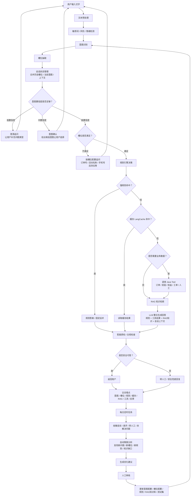

目录

```
AI-Customer-Service
│
├── 01.总体架构.md
├── 02.Intent Router设计.md
├── 03.Rule Engine设计.md
├── 04.LangCache设计.md
├── 05.RAG设计.md
├── 06.Agent Tool设计.md
├── 07.Prompt工程.md
├── 08.Embedding设计.md
├── 09.知识库管理.md
├── 10.持续学习(Human in the Loop).md
├── 11.后台管理系统.md
├── 12.监控与运维.md
├── 13.性能优化.md
├── 14.高可用设计.md
└── 15.完整时序图.md
```

```
# 企业级智能客服整体处理流程（生产版）

​```text
                                ┌────────────────────┐
                                │     用户提问        │
                                └─────────┬──────────┘
                                          │
                                          ▼
                           ┌────────────────────────┐
                           │   文本预处理(NLP)       │
                           │                        │
                           │ ① 去空格               │
                           │ ② 全角半角转换         │
                           │ ③ 拼写纠错             │
                           │ ④ 敏感词过滤           │
                           │ ⑤ 同义词归一           │
                           └─────────┬──────────────┘
                                     │
                                     ▼
                    ┌────────────────────────────────┐
                    │        意图识别(Intent)         │
                    └────────────────────────────────┘
                                     │
                ┌────────────────────┼────────────────────┐
                │                    │                    │
                ▼                    ▼                    ▼
      ┌────────────────┐   ┌────────────────┐   ┌────────────────┐
      │规则引擎(Rule)  │   │Embedding分类   │   │LLM分类         │
      │                │   │                │   │                │
      │关键词          │   │语义分类        │   │复杂推理分类     │
      │正则            │   │TopK            │   │最终兜底         │
      │词典            │   │Similarity      │   │                │
      └────────┬───────┘   └────────┬───────┘   └────────┬───────┘
               └──────────────┬──────────────────────────┘
                              │
                              ▼
               ┌────────────────────────────────┐
               │ 得到统一 IntentResult           │
               │                                │
               │ intent                         │
               │ confidence                     │
               │ allow_cache                    │
               │ need_user_data                 │
               │ need_rag                       │
               │ need_tool                      │
               │ need_human                     │
               │ slots                          │
               └──────────────┬─────────────────┘
                              │
        ┌─────────────────────┼─────────────────────┐
        │                     │                     │
        ▼                     ▼                     ▼

┌────────────────┐   ┌────────────────┐   ┌────────────────┐
│FAQ类问题       │   │业务查询类      │   │人工客服类      │
│活动规则        │   │订单            │   │投诉            │
│产品介绍        │   │奖励            │   │高风险          │
└───────┬────────┘   │权益            │   └──────┬─────────┘
        │            │库存            │          │
        │            └──────┬─────────┘          │
        │                   │                    │
        ▼                   ▼                    ▼
┌────────────────┐  ┌────────────────┐  ┌────────────────┐
│ LangCache      │  │ Agent Tool     │  │ 转人工         │
│ Redis Vector   │  │                │  └────────────────┘
└───────┬────────┘  │ 调Java接口      │
        │           │ 查订单          │
        │           │ 查权益          │
        │           │ 查活动          │
        │           └──────┬─────────┘
        │                  │
        │                  ▼
        │        ┌────────────────┐
        │        │ Java业务系统    │
        │        │                │
        │        │ MySQL          │
        │        │ Redis          │
        │        │ Kafka          │
        │        └────────────────┘
        │
        ▼
┌────────────────────────────────────┐
│ LangCache 命中？                    │
└──────────────┬─────────────────────┘
               │
        ┌──────┴──────┐
        │             │
      命中          未命中
        │             │
        ▼             ▼
 返回缓存答案   ┌──────────────────────┐
               │       RAG检索         │
               │                      │
               │ BM25                │
               │ +                   │
               │ Vector Search       │
               │ +                   │
               │ Rerank              │
               └─────────┬──────────┘
                         │
                         ▼
               ┌──────────────────────┐
               │ Prompt组装           │
               │                      │
               │ 用户问题             │
               │ 知识库               │
               │ Tool结果             │
               │ 上下文               │
               └─────────┬──────────┘
                         │
                         ▼
               ┌──────────────────────┐
               │ 大模型(DeepSeek/Qwen) │
               └─────────┬──────────┘
                         │
                         ▼
               ┌──────────────────────┐
               │ 输出答案              │
               └─────────┬──────────┘
                         │
         ┌───────────────┼────────────────┐
         │                                │
         ▼                                ▼
  写入 LangCache                  保存聊天记录
         │                                │
         ▼                                ▼
     返回用户                     日志/监控/分析
​```

---

# 各模块职责

## 1、文本预处理

负责标准化用户输入：

* 拼写纠错
* 同义词替换（"没到账"→"未到账"）
* 去除无意义字符
* 敏感词过滤

---

## 2、意图识别（Intent Router）

这是整个客服的大脑。

输出统一结构：

​```json
{
  "intent": "reward_not_arrived",
  "confidence": 0.96,
  "allow_cache": false,
  "need_user_data": true,
  "need_rag": true,
  "need_human": false,
  "slots": {
    "activity_type": "ETC"
  }
}
​```

---

## 3、规则引擎

来源：

* MySQL 规则库
* Redis 缓存
* Python 内存

支持：

* 关键词
* 正则
* 词典
* 排除词
* 优先级
* JSON 配置
* 热更新

---

## 4、LangCache

仅缓存：

* FAQ
* 产品介绍
* 活动规则
* 固定政策

绝不缓存：

* 用户余额
* 用户订单
* 奖励到账状态
* 权益数量

---

## 5、Agent Tool

负责查询实时业务数据：

例如：

* 查询订单
* 查询权益
* 查询奖励
* 查询库存

全部通过 Java 提供 API。

Python 不直接访问业务数据库。

---

## 6、RAG

负责知识检索：

​```
BM25
+
Vector
+
Rerank
​```

只负责提供知识，不直接回答。

---

## 7、大模型

负责：

* 理解问题
* 综合知识
* 组织自然语言
* Tool Calling
* 多轮对话

---

## 8、结果回写

包括：

* LangCache（仅可缓存问题）
* 聊天记录
* 用户反馈
* 命中日志
* Token 消耗
* 模型耗时

---

# 推荐技术栈

​```
前端
    Vue3

↓

Python FastAPI

↓

Intent Router

↓

Rule Engine

↓

LangCache（Redis Vector）

↓

Agent

↓

RAG
（ES + Vector + Rerank）

↓

DeepSeek / Qwen

↓

Java Business API

↓

MySQL
Redis
Kafka
​```

# 核心设计原则

1. **规则解决确定性问题**（快、稳定、成本低）。
2. **Embedding 解决语义分类**（提高召回率）。
3. **LLM 只处理复杂问题和最终生成**（避免每个请求都调用模型）。
4. **LangCache 只缓存稳定、通用、非个人化答案**。
5. **所有实时业务数据统一通过 Java API 获取，Python 不直接访问业务数据库。**
6. **规则、意图、缓存策略全部配置化，可热更新、可灰度、可回滚。**
7. **全链路记录日志、命中率、耗时和用户反馈，持续优化规则和模型。**

```

