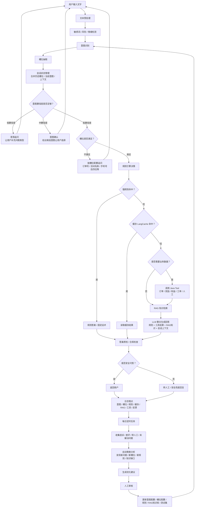

# 生产级智能客服文字输入链路设计方案

## 1. 目标

本方案用于指导智能客服从 Demo 进入生产级开发阶段，优先完成文字输入链路，后续再扩展语音输入业务。

目标不是简单接入大模型聊天，而是建设一套可控、可审计、可迭代的智能客服系统：

- 能识别用户意图
- 能管理多轮会话上下文
- 能补齐业务所需槽位
- 能优先命中规则、缓存和业务系统
- 能通过 RAG 获取知识
- 能用 LLM 整合表达
- 能在低置信度、高风险或用户不满时转人工
- 能通过每日反馈闭环持续优化

## 2. 总体链路



## 3. 核心原则

### 3.1 LLM 不作为业务事实源

订单状态、奖励到账、权益可用性、退款状态等业务事实必须来自 Java Tool、数据库、规则或知识库。

LLM 的职责是：

- 理解用户表达
- 辅助意图识别和槽位抽取
- 整合规则、Tool、RAG 的结果
- 生成自然、礼貌、清晰的客服回复

LLM 不应凭空判断用户账户状态。

### 3.2 强规则优先

涉及合规、隐私、投诉、退款、金额争议、固定政策的问题，应优先命中强规则。

强规则命中后，LLM 只能改写表达，不允许改变事实和政策。

### 3.3 信息不足先追问

不要在缺少订单号、活动名称、手机号后四位等关键信息时直接给确定答案。

生产级客服应优先判断：

- 当前意图是否明确
- 业务槽位是否满足
- 是否可以调用 Tool
- 是否需要追问或转人工

## 4. 文本预处理

文本预处理负责把用户输入整理成适合后续识别的结构化信息。

建议能力：

- 去除多余空格、特殊符号
- 中英文标点归一化
- 简繁转换，按业务需要决定
- 同义词归一，如“返利”“奖励”“返现”
- 敏感词识别
- 情绪识别，如焦急、投诉、辱骂
- 基础实体识别，如订单号、手机号后四位、日期、金额

输出示例：

```json
{
  "raw_text": "我的618返现怎么还没到？订单号是 123456",
  "normalized_text": "我的618返现怎么还没到 订单号是123456",
  "entities": {
    "order_id": "123456",
    "activity_name": "618返现"
  },
  "risk": {
    "sensitive": false,
    "emotion": "normal"
  }
}
```

## 5. 意图识别

意图识别用于判断用户想办理什么事情。

第一阶段建议先覆盖高频意图：

- `reward_not_received`：奖励未到账
- `points_query`：积分查询
- `rights_query`：权益查询
- `order_query`：订单查询
- `bill_query`：账单查询
- `human_handoff`：转人工
- `complaint`：投诉
- `unknown`：未知意图

意图识别结果必须包含置信度：

```json
{
  "intent": "reward_not_received",
  "confidence": 0.92,
  "candidates": [
    {"intent": "reward_not_received", "confidence": 0.92},
    {"intent": "refund_not_received", "confidence": 0.41}
  ]
}
```

## 6. 置信度分流

置信度分流用于避免系统自信地答错。

推荐初始阈值：

```text
confidence >= 0.85
  高置信度，直接进入业务流程

0.60 <= confidence < 0.85
  中置信度，追问确认

confidence < 0.60
  低置信度，澄清问题或转人工
```

处理策略：

- 高置信度：进入槽位检查和规则决策
- 中置信度：给用户候选意图确认
- 低置信度：请求用户补充描述
- 连续低置信度两次：建议转人工

示例：

```text
您是想咨询以下哪一类问题？
1. 奖励未到账
2. 退款未到账
3. 订单未发货
```

## 7. 槽位管理

槽位管理用于跟踪某个业务意图所需的关键信息是否已经齐全。

意图识别告诉系统“用户想干什么”，槽位管理告诉系统“办这件事还需要哪些信息”。

### 7.1 槽位配置

槽位建议人工配置，不要写死在规则引擎代码里。

第一阶段可以使用 YAML 或 JSON 配置，后续迁移到数据库和运营后台。

示例：

```yaml
reward_not_received:
  name: 奖励未到账
  slots:
    order_id:
      name: 订单号
      type: string
      required: false
      validation: "^[A-Za-z0-9_-]{6,64}$"
      ask_prompt: 请提供订单号，我帮您查询奖励到账情况。
    activity_name:
      name: 活动名称
      type: string
      required: false
      ask_prompt: 请提供活动名称，比如618消费返现、拉新奖励等。
    phone_tail:
      name: 手机号后四位
      type: string
      required: false
      validation: "^\\d{4}$"
      ask_prompt: 请提供手机号后四位，方便我帮您定位。
  ready_policy:
    type: any_of
    slots:
      - order_id
      - activity_name
      - phone_tail
  tool: reward_query
```

### 7.2 会话槽位状态

每个 `session_id` 保存当前槽位状态。

```json
{
  "session_id": "abc",
  "current_intent": "reward_not_received",
  "slots": {
    "activity_name": "618消费返现",
    "order_id": "123456",
    "phone_tail": null
  },
  "missing_slots": [],
  "turn_count": 3,
  "updated_at": "2026-06-28T10:00:00"
}
```

建议每个槽位额外保存：

- `value`：槽位值
- `confidence`：抽取置信度
- `source_text`：来源文本
- `source_turn`：来源轮次
- `validated`：是否通过校验
- `updated_at`：更新时间

### 7.3 缺槽位追问

如果槽位不满足业务调用条件，系统不应直接回答，而应追问。

示例：

```text
为了帮您查询奖励到账情况，请提供订单号、活动名称或手机号后四位。
```

## 8. 规则引擎

规则引擎负责读取意图、槽位、置信度、上下文、风险信息后做决策。

规则引擎可以判断：

- 是否命中强规则
- 槽位是否满足
- 是否追问
- 是否调用 Java Tool
- 是否走 RAG
- 是否使用缓存
- 是否转人工

规则配置需要具备：

- 优先级
- 作用域
- 生效时间
- 版本号
- 灰度开关
- 命中日志
- 冲突处理策略

不要把槽位定义硬编码进规则引擎。槽位是配置，规则引擎负责执行判断。

## 9. LangCache 缓存策略

缓存可以提升响应速度并降低模型成本，但客服场景必须防止误答。

适合缓存：

- 通用 FAQ
- 标准活动规则
- 意图识别结果
- RAG 检索结果
- 非敏感的固定话术

谨慎缓存：

- 用户订单状态
- 奖励到账状态
- 账户权益状态
- 退款状态

动态业务数据建议短 TTL 缓存，且缓存 key 必须包含：

```text
intent + slots + user_scope + knowledge_version + policy_version
```

涉及隐私、金额、账户状态的最终答案不建议长期缓存。

## 10. RAG 知识检索

RAG 用于回答政策、活动规则、权益说明、流程说明等知识型问题。

生产级 RAG 必须管理知识版本：

- 文档 ID
- 文档版本
- 生效时间
- 失效时间
- 来源系统
- 检索分数
- 命中文档片段

回答日志中应记录 RAG 来源，便于后续排查。

如果 RAG 命中分数过低，不要硬答，应追问或转人工。

## 11. Java Tool 设计

Java Tool 是真实业务数据来源。

建议将 Java 后端能力封装成标准 Tool：

- `reward_query`：奖励查询
- `order_query`：订单查询
- `points_query`：积分查询
- `rights_query`：权益查询
- `bill_query`：账单查询
- `ticket_create`：创建工单
- `human_handoff`：转人工

Tool 层必须具备：

- 参数校验
- 权限校验
- 超时控制
- 重试策略
- 熔断降级
- 幂等 key
- 错误码标准化
- 审计日志

LLM 不直接访问数据库，应通过 Tool 获取业务结果。

## 12. LLM 整合回答

LLM 最终生成回答时，输入应包含：

- 当前意图
- 已确认槽位
- 规则结果
- Tool 结果
- RAG 结果
- 会话摘要
- 风险约束
- 输出格式要求

LLM 输出需要遵守：

- 先给结论，再给处理步骤
- 不编造账户真实状态
- 对缺失信息进行追问
- 涉及隐私、金额、投诉时谨慎
- 不改变强规则和 Tool 返回事实

## 13. 人工转接策略

不要等用户彻底崩溃才转人工。

建议触发人工的情况：

- 用户明确要求人工
- 投诉、辱骂、强负面情绪
- 连续两次低置信度
- 连续两次工具调用失败
- 同一问题多轮未解决
- 涉及退款、投诉、法律、隐私、金额争议
- 答案质检不通过

转人工时需要携带上下文：

- 用户原始问题
- 意图识别结果
- 槽位状态
- Tool 调用记录
- RAG 命中文档
- 已回复内容
- 转人工原因

## 14. 答案质检和合规检查

返回用户前建议增加轻量质检。

检查内容：

- 是否包含敏感信息
- 是否编造业务事实
- 是否和 Tool 结果冲突
- 是否违反强规则
- 是否需要转人工
- 是否回答了用户问题
- 是否缺少必要追问

高风险问题可以走更严格质检。

## 15. 日志埋点和可观测性

生产级系统必须一开始就记录关键链路。

每轮对话建议记录：

- `session_id`
- `message_id`
- 用户输入
- 预处理结果
- 意图和置信度
- 槽位和置信度
- 规则命中情况
- 缓存命中情况
- RAG 文档和分数
- Tool 调用参数、耗时、结果、错误码
- LLM 模型、耗时、成本
- 最终答案
- 用户反馈
- 转人工原因

核心指标：

- 意图识别准确率
- 槽位补齐率
- 规则命中率
- 缓存命中率
- RAG 命中率
- Tool 成功率
- 转人工率
- 差评率
- 平均响应时间
- 平均解决轮次
- LLM 成本

## 16. 每日自学习闭环

每日定时任务收集：

- 投诉
- 差评
- 申请人工
- 多轮未解决
- 低置信度问题
- Tool 失败问题
- RAG 无命中问题

系统自动分析：

- 聚类高频失败问题
- 推荐新增意图
- 推荐新增槽位
- 推荐新增规则
- 发现知识库缺口
- 生成测试样本

上线流程：

```text
系统发现问题
生成优化建议
人工审核
测试集验证
灰度发布
线上监控
```

不建议自动学习后直接上线，必须人工审核。

## 17. 风险点和控制措施

### 17.1 LLM 幻觉

风险：模型编造订单、奖励、权益状态。

控制：

- 业务事实只来自 Tool、规则、RAG
- 强规则不可被 LLM 改写
- 质检检查答案和 Tool 结果是否冲突

### 17.2 意图识别错误

风险：后续槽位、规则、Tool 全部走错。

控制：

- 置信度分流
- 多候选意图
- 中低置信度追问确认
- 连续失败转人工

### 17.3 槽位误抽

风险：把日期、活动名、订单号抽错，导致查错。

控制：

- 正则校验
- 槽位置信度
- 来源文本记录
- 低置信度槽位追问确认

### 17.4 规则冲突

风险：规则越来越多后互相覆盖。

控制：

- 优先级
- 版本号
- 灰度开关
- 命中日志
- 冲突检测

### 17.5 缓存误答

风险：把旧状态、他人状态或过期政策返回给用户。

控制：

- 区分 FAQ 缓存和业务数据缓存
- 动态数据短 TTL
- 缓存 key 加用户范围和知识版本
- 敏感最终答案不长期缓存

### 17.6 RAG 知识过期

风险：使用旧活动规则或旧政策。

控制：

- 文档版本管理
- 生效/失效时间
- 回答记录引用来源
- 低分不硬答

### 17.7 Tool 稳定性

风险：业务接口超时、失败、重复创建工单。

控制：

- 超时
- 重试
- 熔断
- 幂等
- 错误码标准化
- 降级和转人工

### 17.8 隐私和合规

风险：手机号、订单号、支付信息进入日志、缓存或模型上下文。

控制：

- 日志脱敏
- 最小化传给 LLM 的个人信息
- 敏感字段不长期缓存
- 权限分级
- 操作审计
- 数据保留周期

### 17.9 成本和延迟

风险：每轮都调用多次模型，响应慢且成本高。

控制：

- 规则和缓存优先
- 简单意图使用轻量模型或规则
- 低风险问题简化链路
- 最终 LLM 只在需要整合时调用
- 异步记录和分析

## 18. 第一阶段建议落地范围

第一阶段不要一次性做完全部能力，建议先完成最小生产闭环：

```text
文本预处理
→ 意图识别
→ 槽位管理
→ 规则决策
→ Java Tool
→ LLM 整合
→ 日志埋点
→ 人工转接
```

首批意图建议：

- 奖励未到账
- 积分查询
- 权益查询
- 订单查询
- 转人工
- 投诉

第二阶段再逐步增强：

- LangCache
- RAG 知识库
- 答案质检
- 每日自学习闭环
- 运营审核后台

## 19. 推荐模块结构

```text
backend/app/
  preprocessing/
    normalizer.py
    risk_detector.py
  intent/
    classifier.py
    schemas.py
  slots/
    schemas.py
    extractor.py
    manager.py
    policies.py
  session/
    store.py
  rules/
    engine.py
    schemas.py
  cache/
    langcache.py
  rag/
    retriever.py
    schemas.py
  tools/
    reward_tool.py
    order_tool.py
    points_tool.py
    rights_tool.py
    handoff_tool.py
  llm/
    generator.py
    prompts.py
  quality/
    checker.py
  observability/
    logger.py
    metrics.py
  orchestrator.py
```

## 20. 总结

这套方案的核心不是让 LLM 独立完成客服，而是让 LLM 进入一个受控流程：

```text
规则控制边界
Tool 提供事实
RAG 提供知识
槽位保证信息完整
置信度决定分流
人工审核保证安全
日志指标支撑迭代
```

生产级智能客服的关键风险不在于能否调用大模型，而在于能否控制大模型、验证业务事实、追踪错误原因，并持续安全地迭代。
